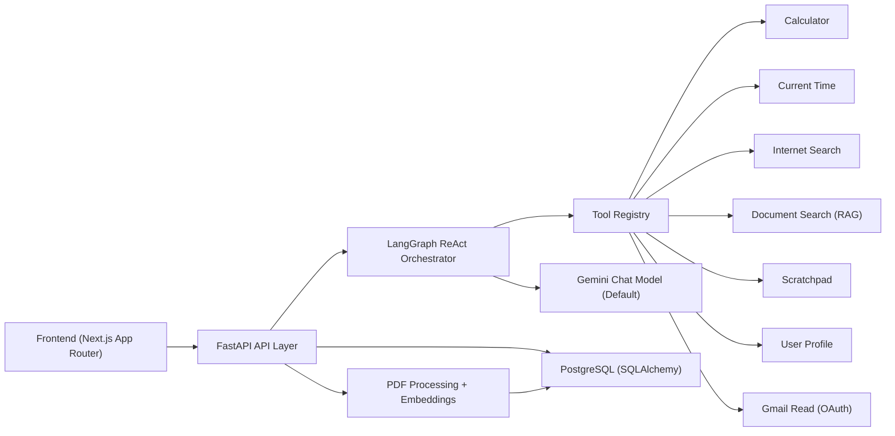

# Personal Agent

A local-first AI assistant platform built around a LangGraph orchestrator, with tool-calling, persistent conversation memory, and PDF-based retrieval.

This project demonstrates practical AI product engineering: orchestration patterns, modular tooling, RAG over user documents, and a production-style backend/frontend split.

## What It Does

The assistant can:
- Hold multi-turn conversations with persisted history
- Route requests to tools (calculator, time, internet search, scratchpad, user profile)
- Process uploaded PDFs and answer document-grounded questions
- Show transparent tool actions in the UI
- Maintain conversation titles and summarize long histories to manage context

## Architecture



### Request Flow

Current runtime path:
1. User sends a message from the frontend.
2. `POST /chat` or `POST /runs` submits asynchronous work and returns a `run_id`.
3. Backend executes run steps asynchronously with per-session serialization (tool selection, tool execution, synthesis).
4. Frontend polls `GET /runs/{run_id}/status` and `GET /runs/{run_id}/events` for real-time updates.

## Implemented Capabilities

| Capability | Status | Notes |
|---|---|---|
| Conversation API + persistence | Implemented | PostgreSQL-backed conversations/messages |
| Tool orchestration (LangGraph ReAct) | Implemented | Dynamic tool availability by context |
| Calculator tool | Implemented | Input-validated arithmetic evaluation |
| Time tool | Implemented | Current date/time responses |
| Document upload + RAG search | Implemented | PDF chunking + embeddings + semantic search |
| Scratchpad tool | Implemented | Persistent per-user notes |
| User profile tool | Implemented | Long-term profile memory (JSON + LLM merge) |
| Internet search tool | Implemented | DuckDuckGo default, optional Bing/Google/SerpAPI |
| Gmail read tool | Conditional | Available by default when Gmail credentials and dependencies are present; disable with `ENABLE_GMAIL_INTEGRATION=false` |
| Calendar/Todoist tools | Placeholder | Scaffold exists, not wired into active tool set |

## Stack

- Backend: Python, FastAPI, LangChain, LangGraph, SQLAlchemy
- LLM/Embeddings: Gemini by default (`gemini-2.5-flash` + `gemini-embedding-001`), OpenAI optional via config
- Frontend: Next.js + React
- Storage: PostgreSQL + local filesystem (`data/`)

## Runtime and Migration Status

Contributor reference for current implementation:
- Dependency source of truth:
  - Backend: `backend/requirements.txt`
  - Frontend: `frontend/package.json`
- Completed baseline:
  - LangGraph ReAct orchestration is the active architecture.
  - Tool routing is centralized in the orchestrator tool registry.
- Async runtime (completed `#15`, `#16`, `#17`):
  - Run lifecycle schema with per-session durability and retry logic.
  - Async submission via `POST /runs` and `POST /chat`.
  - Real-time status and event polling via `GET /runs/{run_id}/status` and `GET /runs/{run_id}/events`.
  - Background worker execution with per-session serialization guarantees.
  - `/api/v1/*` remains active for non-runtime endpoints (conversations/tools/documents/health).

## Quick Start (Docker, Recommended)

### 1) Prerequisites

- Docker Desktop (or Docker Engine + Compose plugin)
- Gemini API key (default provider)

### 2) Configure environment

```bash
git clone https://github.com/gtpooniwala/personal-agent.git
cd personal-agent
cp .env.example .env
# Edit .env and set GEMINI_API_KEY
# Optional observability: set LANGFUSE_PUBLIC_KEY / LANGFUSE_SECRET_KEY / LANGFUSE_BASE_URL
# `DATABASE_URL` is used for local host runtime.
# `DATABASE_URL_DOCKER` is used by the backend container in docker compose.
# `TEST_DATABASE_URL` / `EVAL_DATABASE_URL` should point to a dedicated PostgreSQL *_test database for tests/evals.
```

### 3) Start backend + frontend

```bash
docker compose up --build
```

### 4) Access services

- Frontend: [http://127.0.0.1:3000](http://127.0.0.1:3000)
- Backend API: [http://127.0.0.1:8000](http://127.0.0.1:8000)
- Swagger UI: [http://127.0.0.1:8000/docs](http://127.0.0.1:8000/docs)

### 5) Stop services

```bash
docker compose down
```

### Docker Troubleshooting

Rebuild and restart services:

```bash
docker compose up --build -d
docker compose ps
```

Inspect logs:

```bash
docker compose logs -f personal-agent frontend
```

Clean shutdown:

```bash
docker compose down
```

## Debugging Without Docker (Optional)

Use this only when you need local debugging outside containers.

### Prerequisites

- Python 3.11+
- Node.js 20.9+

### Backend (debug)

```bash
python3 -m venv .venv
source .venv/bin/activate
pip install -r backend/requirements.txt
uvicorn backend.main:app --host 127.0.0.1 --port 8000 --reload
```

### Frontend (debug, new terminal)

```bash
cd frontend
npm install
npm run dev
```

## Alternative Local Scripts

The repo includes:
- `setup.sh`: conda-based setup
- `start_server.sh`: macOS Terminal automation (`osascript`) for backend + frontend startup

Use these for local debugging if your environment matches their assumptions.

## Running Tests

Standard local validation command:

```bash
scripts/run_local_checks.sh
```

This command:
- creates `.venv` if needed
- installs backend dependencies
- runs guarded unit tests (`tests/run_unit_tests.py`)
- runs deterministic repository checks (`tests/run_repo_checks.py`)

Note: `scripts/run_local_checks.sh` forces tests onto `TEST_DATABASE_URL` to avoid touching runtime data.

Guardrails:
- no discovered tests = non-pass
- skip-only unit test runs = non-pass

Optional direct unit-test runner:

```bash
python3 tests/run_unit_tests.py
```

Optional (if you use `pytest` directly):

```bash
pytest tests -q
```

Some tests rely on API/LLM behavior and are easier to run in an environment with full project dependencies.

## Running Repository Checks

Run deterministic repository checks:

```bash
python tests/run_repo_checks.py
```

## Observability Baseline

- Structured JSON logs are emitted by the backend (request ID + route + latency fields).
- Runtime counters are stored in PostgreSQL (`runtime_counters` table).
- Langfuse tracing is enabled when the following env vars are set:
  - `LANGFUSE_PUBLIC_KEY`
  - `LANGFUSE_SECRET_KEY`
  - `LANGFUSE_BASE_URL` (defaults to `https://cloud.langfuse.com`)
  - `LANGFUSE_ENABLED=true`
  - Optional: `LANGFUSE_SAMPLE_RATE` (`0.0` to `1.0`)

Langfuse instrumentation currently covers active API endpoints and orchestration paths (excluding `GET /api/v1/health` by design).

These checks run in CI because they are deterministic and fast.

Local report artifact:
- Report: `tests/repo_checks/results.json` (gitignored)

## Running LLM/Workflow Evals

LLM/workflow evals should be run locally when changes affect model prompts, tool-calling behavior, or orchestration flow.

Deterministic harness run:

```bash
python tests/run_llm_evals.py --mode mock
```

Live orchestrator/model run:

```bash
python tests/run_llm_evals.py --mode live
```

Reports are written to `tests/llm_evals/results/latest.json` and timestamped report files.
If the provider key is missing, live mode exits as `blocked` and tells you which key to configure.

## API Surface

Base URL: `http://127.0.0.1:8000`

Route notation:
- Primary notation in docs: bare routes (`/chat`, `/runs`, ...)
- Legacy compatibility notation: `/api/v1/...` (older deployments)
- Runtime endpoints are served as bare routes.
- Non-runtime endpoints remain versioned under `/api/v1`.

Core endpoints:
- `POST /runs`
- `GET /runs/{run_id}/status`
- `GET /runs/{run_id}/events`
- `POST /chat`
- `GET /api/v1/conversations`
- `POST /api/v1/conversations`
- `GET /api/v1/conversations/{conversation_id}/messages`
- `GET /api/v1/tools`
- `POST /api/v1/documents/upload`
- `GET /api/v1/documents`
- `DELETE /api/v1/documents/{document_id}`
- `POST /api/v1/conversations/{conversation_id}/generate-title`
- `GET /api/v1/health`

Interactive docs:
- Swagger UI: [http://127.0.0.1:8000/docs](http://127.0.0.1:8000/docs)
- OpenAPI: [http://127.0.0.1:8000/openapi.json](http://127.0.0.1:8000/openapi.json)

## Repository Layout

```text
personal-agent/
├── backend/
│   ├── api/                   # FastAPI routes + schemas
│   ├── orchestrator/          # LangGraph orchestrator + tool registry
│   ├── orchestrator/tools/    # Tool implementations
│   ├── services/              # Document processing + retrieval
│   ├── database/              # SQLAlchemy models + operations
│   └── main.py                # API entrypoint
├── frontend/                  # Next.js frontend app
├── tests/                     # Unit/integration-style tests
├── docs/                      # Extended architecture + feature docs
└── data/                      # Local runtime data (DB, uploads, profiles, scratchpad)
```

## Engineering Notes

Design choices reflected in this implementation:
- **Graph-based orchestration** over hardcoded routing, so behavior can evolve by adding tools and prompt policy.
- **Context-aware tool gating** (e.g., document search appears only when documents are selected).
- **Separation of orchestration and response synthesis**, which keeps tool execution traces inspectable while preserving fluent final responses.
- **Local-first persistence** for fast iteration and debuggability.

## Current Limitations

- Single-user default (`user_id="default"`) across most flows.
- Document retrieval computes similarity from embeddings stored in PostgreSQL; not yet an external vector DB.
- Tool/model config exists, but some model selections are still hardcoded in tool/orchestrator paths.
- Integration tools (Gmail/Calendar/Todoist) have different maturity levels and setup requirements.

## Roadmap (High-Impact)

- Multi-user auth + tenant isolation
- Managed vector store option
- Expand eval coverage for tool-selection accuracy and regression checks
- Observability for latency/token/tool metrics
- Production deployment profile (secrets, health checks, structured logging)

## Documentation

- [Architecture](docs/ARCHITECTURE.md)
- [API](docs/API.md)
- [Runtime Migration Architecture](docs/MIGRATION_RUNTIME_ARCHITECTURE.md)
- [Feature Overview](docs/FEATURES_OVERVIEW.md)
- [Development Guide](docs/DEVELOPMENT_GUIDE.md)
- [Workboard](docs/WORKBOARD.md)
- [Roadmap](docs/ROADMAP.md)
- [Engineering Workflow](docs/ENGINEERING_WORKFLOW.md)
- [GitHub Issues](https://github.com/gtpooniwala/personal-agent/issues)

## License

MIT. See [LICENSE](LICENSE).
