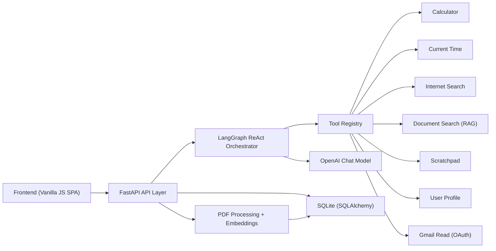

# Personal Agent

A local-first AI assistant platform built around a LangGraph orchestrator, with tool-calling, persistent conversation memory, and PDF-based retrieval.

This project demonstrates practical AI product engineering: orchestration patterns, modular tooling, RAG over user documents, and a production-style backend/frontend split.

## What It Does

The assistant can:
- Hold multi-turn conversations with persisted history
- Route requests to tools (calculator, time, internet search, scratchpad, user profile)
- Process uploaded PDFs and answer document-grounded questions
- Show transparent tool actions in the UI
- Maintain conversation titles and summarize long histories to manage context

## Architecture



### Request Flow

1. User sends a message from the frontend.
2. `POST /api/v1/chat` passes the message and selected document IDs to the orchestrator.
3. The LangGraph ReAct agent chooses tools based on intent and available context.
4. Tool outputs are captured as `agent_actions` and persisted with the response.
5. A response synthesis step generates the final user-facing answer.
6. Conversation history is periodically summarized when token thresholds are exceeded.

## Implemented Capabilities

| Capability | Status | Notes |
|---|---|---|
| Conversation API + persistence | Implemented | SQLite-backed conversations/messages |
| Tool orchestration (LangGraph ReAct) | Implemented | Dynamic tool availability by context |
| Calculator tool | Implemented | Input-validated arithmetic evaluation |
| Time tool | Implemented | Current date/time responses |
| Document upload + RAG search | Implemented | PDF chunking + embeddings + semantic search |
| Scratchpad tool | Implemented | Persistent per-user notes |
| User profile tool | Implemented | Long-term profile memory (JSON + LLM merge) |
| Internet search tool | Implemented | DuckDuckGo default, optional Bing/Google/SerpAPI |
| Gmail read tool | Conditional | Requires OAuth credentials/setup |
| Calendar/Todoist tools | Placeholder | Scaffold exists, not wired into active tool set |

## Stack

- Backend: Python, FastAPI, LangChain, LangGraph, SQLAlchemy
- LLM/Embeddings: OpenAI (`gpt-3.5-turbo` currently in code paths, `text-embedding-ada-002` for document embeddings)
- Frontend: HTML/CSS + modular ES6 JavaScript
- Storage: SQLite + local filesystem (`data/`)

## Quick Start (Manual, Recommended)

### 1) Prerequisites

- Python 3.11+
- OpenAI API key

### 2) Install dependencies

```bash
git clone https://github.com/gtpooniwala/personal-agent.git
cd personal-agent
python3 -m venv .venv
source .venv/bin/activate
pip install -r backend/requirements.txt
```

### 3) Configure environment

```bash
cp .env.example .env
# Edit .env and set OPENAI_API_KEY
```

### 4) Run backend

```bash
uvicorn backend.main:app --host 127.0.0.1 --port 8000 --reload
```

### 5) Run frontend (new terminal)

```bash
cd frontend
python3 -m http.server 8081
```

Open [http://127.0.0.1:8081](http://127.0.0.1:8081).

## Alternative Startup Scripts

The repo includes:
- `setup.sh`: conda-based setup
- `start_server.sh`: macOS Terminal automation (`osascript`) for backend + frontend startup

Use these if your environment matches their assumptions.

## Running Tests

```bash
python -m unittest discover -s tests -p "test_*.py"
```

Optional (if you use `pytest`):

```bash
pytest tests -q
```

Some tests rely on API/LLM behavior and are easier to run in an environment with full project dependencies.

## Running Evals

Run the deterministic repository cleanup eval:

```bash
python tests/run_eval.py
```

Latest baseline (run on **March 4, 2026**):
- Cases: `12`
- Passed: `12`
- Failed: `0`
- Report: `tests/evals/results.json`

## API Surface

Base URL: `http://127.0.0.1:8000/api/v1`

Core endpoints:
- `POST /chat`
- `GET /conversations`
- `POST /conversations`
- `GET /conversations/{conversation_id}/messages`
- `GET /tools`
- `POST /documents/upload`
- `GET /documents`
- `DELETE /documents/{document_id}`
- `POST /conversations/{conversation_id}/generate-title`
- `GET /health`

Interactive docs:
- Swagger UI: [http://127.0.0.1:8000/docs](http://127.0.0.1:8000/docs)
- OpenAPI: [http://127.0.0.1:8000/openapi.json](http://127.0.0.1:8000/openapi.json)

## Repository Layout

```text
personal-agent/
├── backend/
│   ├── api/                   # FastAPI routes + schemas
│   ├── orchestrator/          # LangGraph orchestrator + tool registry
│   ├── orchestrator/tools/    # Tool implementations
│   ├── services/              # Document processing + retrieval
│   ├── database/              # SQLAlchemy models + operations
│   └── main.py                # API entrypoint
├── frontend/                  # Static SPA (HTML/CSS/JS)
├── tests/                     # Unit/integration-style tests
├── docs/                      # Extended architecture + feature docs
└── data/                      # Local runtime data (DB, uploads, profiles, scratchpad)
```

## Engineering Notes

Design choices reflected in this implementation:
- **Graph-based orchestration** over hardcoded routing, so behavior can evolve by adding tools and prompt policy.
- **Context-aware tool gating** (e.g., document search appears only when documents are selected).
- **Separation of orchestration and response synthesis**, which keeps tool execution traces inspectable while preserving fluent final responses.
- **Local-first persistence** for fast iteration and debuggability.

## Current Limitations

- Single-user default (`user_id="default"`) across most flows.
- Document retrieval computes similarity from stored embeddings in SQLite; not yet an external vector DB.
- Tool/model config exists, but some model selections are still hardcoded in tool/orchestrator paths.
- Integration tools (Gmail/Calendar/Todoist) have different maturity levels and setup requirements.

## Roadmap (High-Impact)

- Multi-user auth + tenant isolation
- PostgreSQL + managed vector store option
- Expand eval coverage for tool-selection accuracy and regression checks
- Observability for latency/token/tool metrics
- Production deployment profile (secrets, health checks, structured logging)

## Documentation

- [Architecture](docs/ARCHITECTURE.md)
- [API](docs/API.md)
- [Feature Overview](docs/FEATURES_OVERVIEW.md)
- [Development Guide](docs/DEVELOPMENT_GUIDE.md)

## License

MIT. See [LICENSE](LICENSE).
