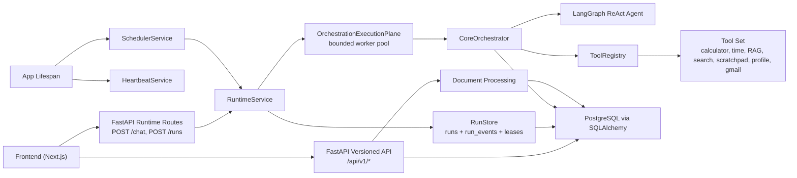

# Architecture Documentation

## System Overview
The repository now has a real async runtime surface, not just a synchronous chat API. The core shape is:

1. the frontend submits work asynchronously,
2. the backend persists a run row and run events,
3. runtime services coordinate execution and recovery,
4. the orchestrator executes tool-aware LangGraph logic against the current conversation state,
5. clients poll the run ledger for progress.

## Architecture Today

## Current Guarantees
- Async submission is the primary contract: `POST /chat` and `POST /runs` return a `run_id` quickly.
- Run progress is durable enough to poll and inspect through `run_events`.
- Ordering is enforced per conversation via leases, so only one active run should execute for a conversation at a time.
- Runtime coordination stays on the event loop while full orchestration attempts run in a bounded worker pool.
- Heartbeat sweeps can mark orphaned runs failed.
- Scheduler service can dispatch stored scheduled tasks into the same runtime path.

## Current Gaps
- Normal tool selection is owned by the LangGraph agent from the bound tool set; remaining follow-up work is about retry policy and whether the degraded catastrophic-path fallback can be reduced further.
- Some follow-up work still runs with in-process `asyncio.create_task(...)`, especially summarisation and maintenance helpers.
- The runtime contract is async and responsive, but true end-to-end async internals are still future work.
- The worker-pool execution plane exists, but lifecycle policy for background work and in-flight shutdown behavior still needs cleanup.

## Main Components

### FastAPI App
- `backend/main.py` wires lifespan, logging, CORS, runtime routes, scheduler routes, and versioned `/api/v1` routes.
- Runtime endpoints live at bare paths.
- Conversations, documents, tools, health, and observability stay under `/api/v1`.

### Runtime Layer
- `backend/runtime/service.py` handles run submission, run status/event reads, per-conversation lease acquisition, retries, and terminal state updates.
- `backend/runtime/orchestration.py` defines `OrchestrationExecutionPlane`, which moves blocking orchestrator work onto a bounded worker pool.
- `backend/runtime/heartbeat.py` sweeps for orphaned runs and marks them failed.
- `backend/runtime/scheduler.py` dispatches due scheduled tasks back into `RuntimeService`.
- `backend/runtime/store.py` and database helpers back the run ledger.

### Orchestrator Layer
- `backend/orchestrator/core.py` builds a fresh LangGraph agent per run to avoid shared mutable run state.
- `ToolRegistry` exposes the active tool set and document-scoped tool availability.
- `ResponseAgentTool` synthesizes user-facing answers from tool results.
- Conversation summarisation and title generation are separate helper flows, not part of the main user response path.

### Storage And Retrieval
- PostgreSQL is the runtime database.
- Conversation history, documents, embeddings, runtime counters, scheduled tasks, and run state all live in the database.
- Uploaded files still use local filesystem storage today, which is one reason cloud deployment needs a GCS migration.

### Frontend
- The frontend is a Next.js app that submits runs, polls run state, renders tool actions, and manages conversations/documents.
- Today it relies on polling rather than SSE streaming.

## Operational Flows

### Chat Or Run Submission
1. Frontend submits a message to `POST /chat` or `POST /runs`.
2. Runtime creates a durable run row and appends a queued event.
3. Runtime starts background coordination for that run.
4. `OrchestrationExecutionPlane` runs the blocking attempt in the worker pool.
5. Client polls `GET /runs/{id}/status` and `GET /runs/{id}/events`.
6. Runtime updates the run row and appends tool/result/terminal events as work completes.

### Scheduled Task Dispatch
1. Scheduler loop queries due scheduled tasks.
2. It acquires a dispatch lease for the task.
3. It submits a normal runtime run using the task message and conversation.
4. It advances `next_run_at` regardless of dispatch success to avoid tight retry loops.

### Conversation Follow-Up Work
1. Successful runs can trigger background title generation.
2. Orchestrator responses can trigger background summarisation.
3. These follow-ups are still in-process tasks rather than durable task rows.

## Design Direction
The intended next shape of the architecture is:
- prompt and tool contracts own normal tool-selection policy,
- follow-up work becomes explicit queued task types,
- runtime internals become easier to shut down, observe, and scale,
- streaming and external triggers build on the same run/event store rather than bypassing it.

## Related Docs
- [`MIGRATION_RUNTIME_ARCHITECTURE.md`](MIGRATION_RUNTIME_ARCHITECTURE.md)
- [`SYSTEM_FLOW.md`](SYSTEM_FLOW.md)
- [`ROADMAP.md`](ROADMAP.md)
- [`DEPLOYMENT.md`](DEPLOYMENT.md)
