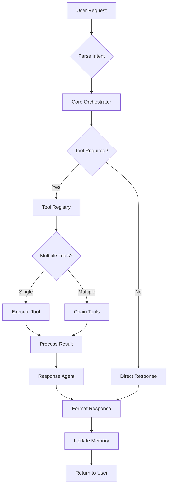
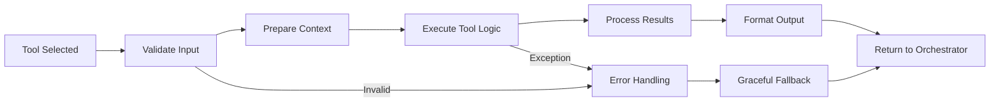
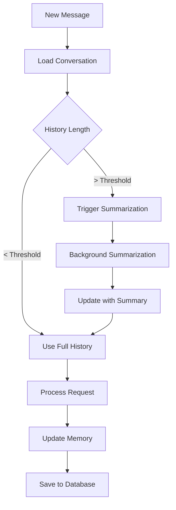
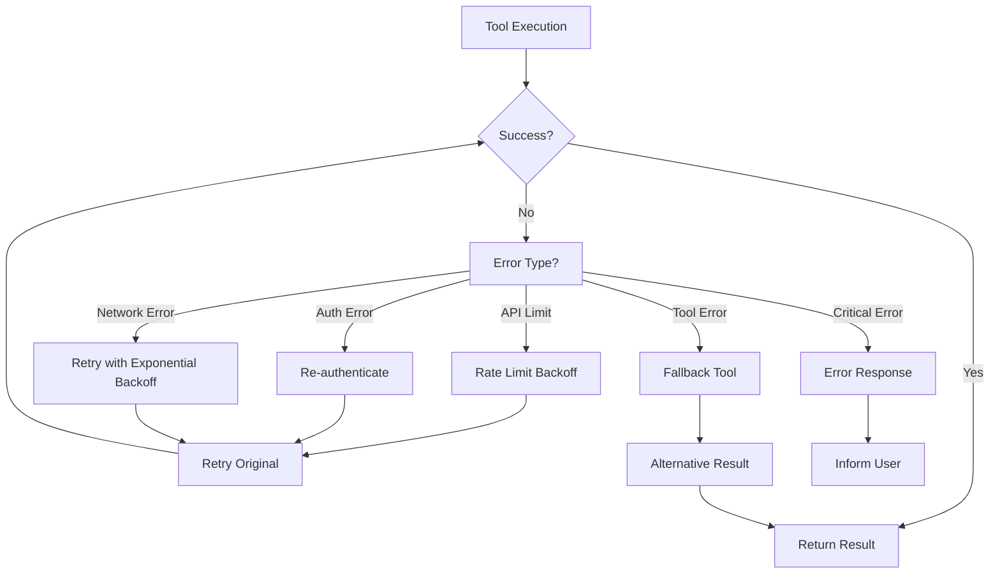

# 🔄 Personal Agent Flow & Logic Documentation

This document provides detailed documentation of the system flow, decision logic, and operational workflows of the Personal Agent.

## 🎯 Core System Flow

This section reflects the migration target runtime: async run submission with status/event polling. The legacy direct flow below is preserved for historical context only.

## Long-Running Runtime Flow (Migration)

```mermaid
graph TB
    A[POST /api/v1/runs] --> B{Persist Run Record}
    B --> C[Run Queue]
    C --> D[Dedicated Worker]
    D --> E[Load Conversation Context]
    E --> F[LangGraph Orchestrator]
    F --> G{Tool Required?}
    G -->|Yes| H[Tool Registry + Tool Execution]
    G -->|No| I[Response Agent]
    H --> J[Emit Tool Events]
    J --> F
    F --> K[Persist Results]
    K --> L[Emit completed/failed events]
    M[GET /runs/{run_id}/status] --> N[Expose lifecycle state]
    M --> O[GET /runs/{run_id}/events]
    O --> P[Expose ordered progress stream]
```

### Transitional compatibility

- `POST /api/v1/chat` remains temporarily available during migration.
- It submits through the same run path and returns deprecation notes for callers.

### High-Level Request Processing



## 🤖 LangGraph Orchestrator Logic

### ReAct Agent Decision Making

The system uses a **ReAct (Reasoning + Acting) pattern** for intelligent decision making:

```python
# Simplified orchestrator logic flow
def orchestrator_cycle(user_input, conversation_state):
    """
    Core orchestration cycle using LangGraph ReAct pattern
    """
    # 1. REASONING PHASE
    reasoning = analyze_user_request(user_input, conversation_state)
    
    # 2. ACTION DECISION
    if requires_tool_usage(reasoning):
        selected_tools = select_optimal_tools(reasoning, available_tools)
        
        # 3. TOOL EXECUTION
        tool_results = execute_tools(selected_tools)
        
        # 4. ITERATIVE REASONING
        updated_reasoning = update_context(reasoning, tool_results)
        
        # 5. CONTINUATION DECISION
        if needs_additional_tools(updated_reasoning):
            return orchestrator_cycle(updated_reasoning, updated_state)
    
    # 6. RESPONSE SYNTHESIS
    return synthesize_response(reasoning, tool_results, conversation_state)
```

### Tool Selection Logic

```python
def tool_selection_logic(user_intent, context):
    """
    Intelligent tool selection based on user intent and context
    """
    available_tools = get_context_aware_tools(context)
    
    # Intent matching patterns
    if matches_calculation_pattern(user_intent):
        return ["calculator"]
    
    if matches_time_query_pattern(user_intent):
        return ["time"]
    
    if matches_document_query_pattern(user_intent) and has_documents(context):
        return ["document_qa"]
    
    if matches_search_pattern(user_intent):
        return ["internet_search"]
    
    if matches_email_pattern(user_intent) and has_gmail_access(context):
        return ["gmail"]
    
    if matches_note_pattern(user_intent):
        return ["scratchpad"]
    
    # Multi-tool scenarios
    if complex_query_requiring_multiple_tools(user_intent):
        return select_tool_chain(user_intent, available_tools)
    
    return []  # No tools needed, direct response
```

## 🔧 Tool Execution Flow

### Individual Tool Lifecycle



### Tool Chain Execution

For complex queries requiring multiple tools:

```python
def execute_tool_chain(tools, initial_input, context):
    """
    Execute multiple tools in optimal sequence
    """
    results = []
    current_context = context
    
    for tool in tools:
        # Each tool can use results from previous tools
        tool_input = prepare_tool_input(initial_input, results, current_context)
        
        try:
            result = execute_tool(tool, tool_input)
            results.append(result)
            current_context = update_context(current_context, result)
        except ToolExecutionError as e:
            # Graceful degradation
            results.append(create_error_result(tool, e))
            continue
    
    return consolidate_results(results, initial_input)
```

## 💾 Memory & Context Management

### Conversation State Flow



### Context-Aware Tool Availability

```python
def get_available_tools(conversation_context, user_context):
    """
    Determine which tools are available based on context
    """
    base_tools = ["calculator", "time", "scratchpad", "response_agent"]
    conditional_tools = []
    
    # Document-dependent tools
    if has_uploaded_documents(conversation_context):
        conditional_tools.append("document_qa")
    
    # Authentication-dependent tools
    if is_gmail_authenticated(user_context):
        conditional_tools.append("gmail")
    
    # Feature flag dependent tools
    if is_feature_enabled("internet_search"):
        conditional_tools.append("internet_search")
    
    if is_feature_enabled("user_profile"):
        conditional_tools.append("user_profile")
    
    return base_tools + conditional_tools
```

## 🔄 Error Handling & Recovery

### Graceful Degradation Flow



### Error Recovery Strategies

```python
def handle_tool_error(tool_name, error, context):
    """
    Implement graceful error handling and recovery
    """
    error_strategies = {
        "calculator": lambda: "I couldn't perform that calculation. Please check the expression.",
        "time": lambda: f"I couldn't get the current time. As of my last update, it was around {fallback_time()}",
        "document_qa": lambda: "I couldn't search your documents. Please try rephrasing your question.",
        "internet_search": lambda: "I couldn't search the internet right now. Let me try to help with what I know.",
        "gmail": lambda: "I couldn't access your Gmail. Please check your authentication.",
        "scratchpad": lambda: "I couldn't access your notes right now. Please try again."
    }
    
    if tool_name in error_strategies:
        return error_strategies[tool_name]()
    
    return f"I encountered an issue with the {tool_name} tool. Let me try a different approach."
```

## 🧠 Intelligence & Reasoning Logic

### Natural Language Understanding

```python
def analyze_user_intent(user_input, conversation_history):
    """
    Multi-layer intent analysis
    """
    # Layer 1: Pattern matching
    explicit_patterns = detect_explicit_tool_requests(user_input)
    
    # Layer 2: Contextual analysis
    contextual_intent = analyze_context_clues(user_input, conversation_history)
    
    # Layer 3: Semantic understanding
    semantic_intent = extract_semantic_meaning(user_input)
    
    # Layer 4: Multi-step detection
    complex_intent = detect_multi_step_requests(user_input)
    
    return synthesize_intent(explicit_patterns, contextual_intent, semantic_intent, complex_intent)
```

### Response Quality Optimization

```python
def optimize_response_quality(tool_results, user_context, conversation_context):
    """
    Ensure responses are natural, helpful, and contextually appropriate
    """
    # Consolidate multiple tool results
    consolidated_info = consolidate_tool_outputs(tool_results)
    
    # Apply user preferences
    personalized_response = apply_user_personalization(consolidated_info, user_context)
    
    # Ensure conversational flow
    contextual_response = maintain_conversation_flow(personalized_response, conversation_context)
    
    # Final quality checks
    return quality_assurance_pass(contextual_response)
```

## 🚀 Performance Optimization Logic

### Caching Strategy

```python
def intelligent_caching(tool_name, tool_input, cache_context):
    """
    Smart caching for expensive operations
    """
    cache_strategies = {
        "document_qa": lambda: cache_document_embeddings(tool_input),
        "internet_search": lambda: cache_search_results(tool_input, ttl=3600),
        "calculator": lambda: cache_calculation_results(tool_input),
        "time": lambda: None,  # Never cache time results
        "gmail": lambda: cache_email_results(tool_input, ttl=300),
    }
    
    if tool_name in cache_strategies and cache_strategies[tool_name]:
        return cache_strategies[tool_name]()
    
    return None
```

### Async Processing

```python
async def async_tool_execution(tools, inputs, context):
    """
    Execute independent tools in parallel for better performance
    """
    # Identify independent tools that can run in parallel
    independent_tools = identify_independent_tools(tools)
    dependent_tools = identify_dependent_tools(tools)
    
    # Execute independent tools in parallel
    parallel_results = await asyncio.gather(*[
        execute_tool_async(tool, inputs[tool]) 
        for tool in independent_tools
    ])
    
    # Execute dependent tools in sequence using results
    sequential_results = []
    for tool in dependent_tools:
        tool_input = prepare_dependent_input(inputs[tool], parallel_results, sequential_results)
        result = await execute_tool_async(tool, tool_input)
        sequential_results.append(result)
    
    return consolidate_async_results(parallel_results, sequential_results)
```

## 📊 Monitoring & Analytics

### System Health Monitoring

```python
def monitor_system_health():
    """
    Continuous monitoring of system performance and health
    """
    metrics = {
        "response_time": measure_average_response_time(),
        "tool_success_rate": calculate_tool_success_rates(),
        "memory_usage": monitor_memory_consumption(),
        "conversation_length": track_conversation_lengths(),
        "error_rates": analyze_error_patterns(),
        "user_satisfaction": infer_user_satisfaction_signals()
    }
    
    # Alert on anomalies
    check_performance_thresholds(metrics)
    
    return metrics
```

This comprehensive flow and logic documentation provides a complete understanding of how the Personal Agent operates internally, from high-level orchestration to detailed error handling and performance optimization.
