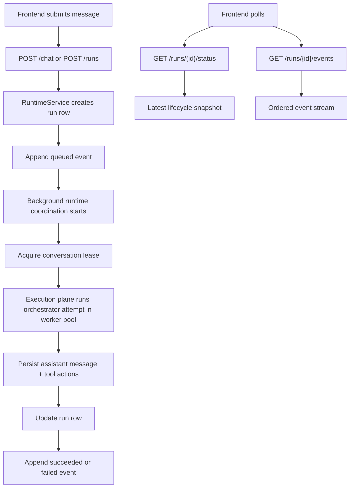
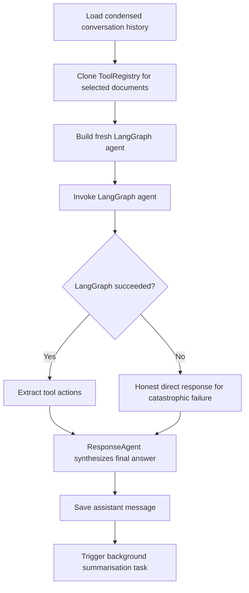
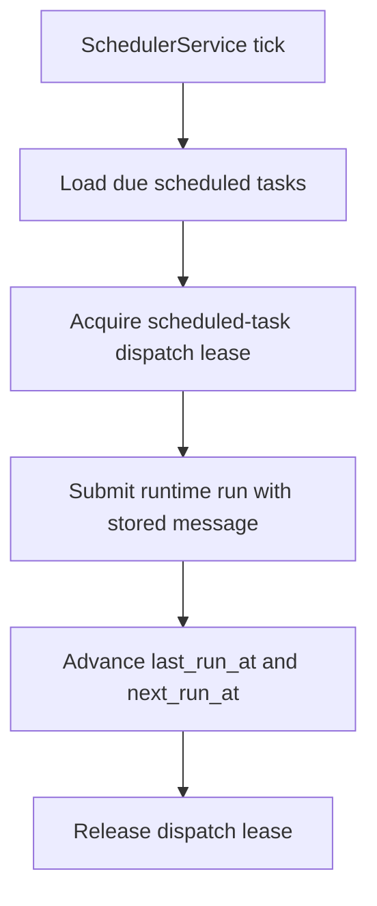
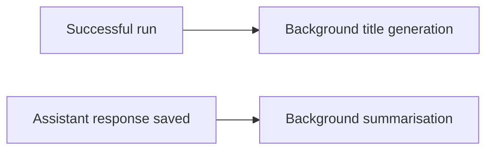

# System Flow

This file describes how the current system behaves on `main`. It is meant to help a reader or agent understand the operational flow quickly, not restate every implementation detail.

## Runtime Submission And Polling

## Current Orchestrator Flow

Important current nuance:
- normal tool use comes from the LangGraph agent using the currently bound tools,
- deterministic code is limited to capability gating and honest failure boundaries,
- retry policy and any further degraded-path cleanup are separate follow-up concerns.

## Scheduled Task Flow

## Follow-Up Work Today

This part is intentionally simple because it is still transitional:
- title generation and summarisation are in-process async tasks,
- blocking follow-up orchestration can now also use the worker-pool execution plane,
- they are not yet stored as durable queued task types,
- budgeting and shutdown behavior for these follow-ups still need cleanup.

## Error And Recovery Model
- Run submission always creates a durable run row first.
- Lease acquisition failures fail the run with a user-visible message for that conversation.
- Execution attempts can retry up to the current configured limit.
- Unexpected runtime failures are written back into the run ledger as terminal failures.
- Heartbeat sweeps can fail orphaned runs if a worker disappears mid-flight.

## Related Docs
- [`ARCHITECTURE.md`](ARCHITECTURE.md)
- [`MIGRATION_RUNTIME_ARCHITECTURE.md`](MIGRATION_RUNTIME_ARCHITECTURE.md)
- [`ROADMAP.md`](ROADMAP.md)
