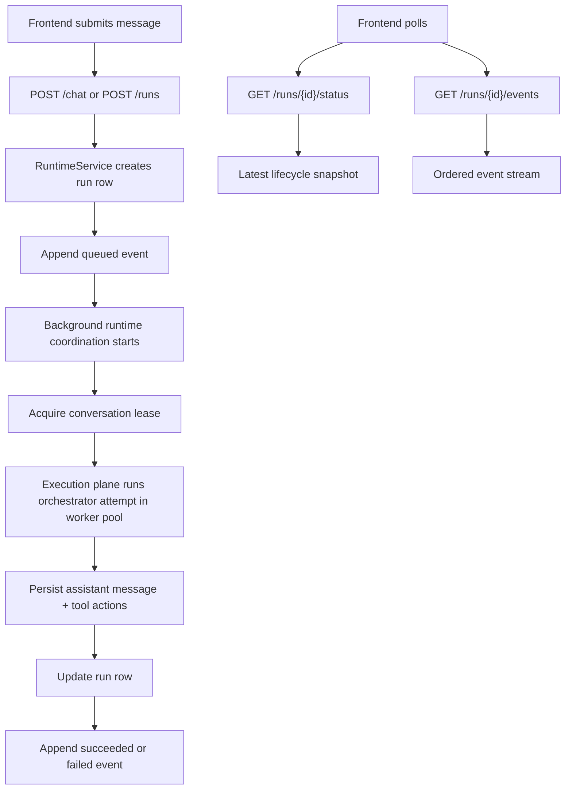
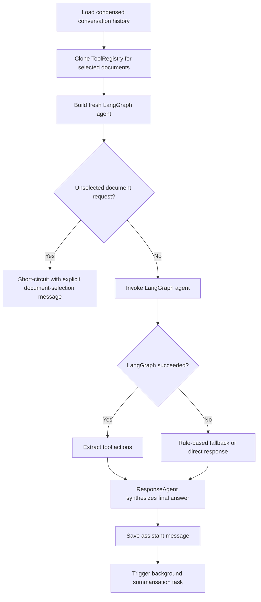
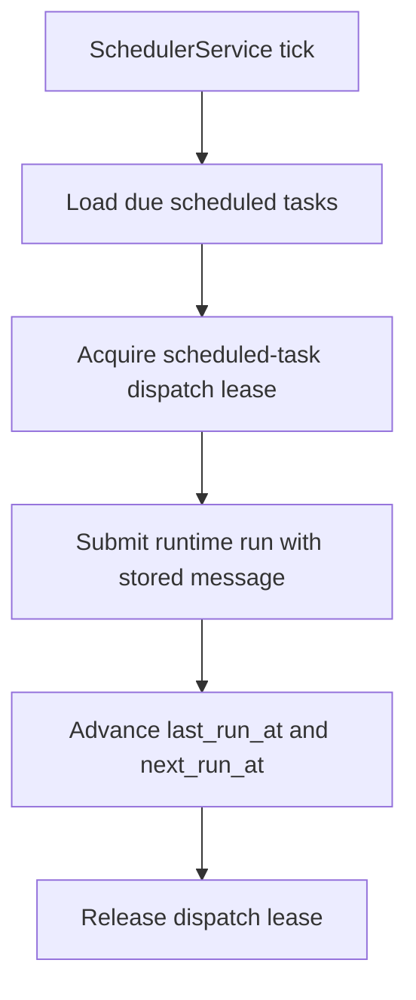
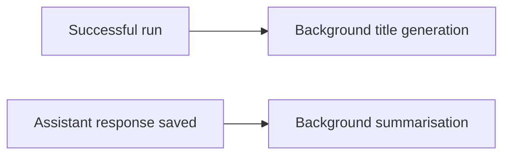

# System Flow

This file describes how the current system behaves on `main`. It is meant to help a reader or agent understand the operational flow quickly, not restate every implementation detail.

## Runtime Submission And Polling



## Current Orchestrator Flow



Important current nuance:
- normal tool use should come from the LangGraph agent,
- but the orchestrator still contains some deterministic routing and fallback logic,
- which is why `#101` is the highest-value cleanup item.

## Scheduled Task Flow



## Follow-Up Work Today



This part is intentionally simple because it is still transitional:
- title generation and summarisation are in-process async tasks,
- blocking follow-up orchestration can now also use the worker-pool execution plane,
- they are not yet stored as durable queued task types,
- budgeting and shutdown behavior for these follow-ups still need cleanup.

## Error And Recovery Model
- Run submission always creates a durable run row first.
- Lease acquisition failures fail the run with a user-visible message for that conversation.
- Execution attempts can retry up to the current configured limit.
- Unexpected runtime failures are written back into the run ledger as terminal failures.
- Heartbeat sweeps can fail orphaned runs if a worker disappears mid-flight.

## Related Docs
- [`ARCHITECTURE.md`](ARCHITECTURE.md)
- [`MIGRATION_RUNTIME_ARCHITECTURE.md`](MIGRATION_RUNTIME_ARCHITECTURE.md)
- [`ROADMAP.md`](ROADMAP.md)
    
    if tool_name in error_strategies:
        return error_strategies[tool_name]()
    
    return f"I encountered an issue with the {tool_name} tool. Let me try a different approach."
```

## 🧠 Intelligence & Reasoning Logic

### Natural Language Understanding

```python
def analyze_user_intent(user_input, conversation_history):
    """
    Multi-layer intent analysis
    """
    # Layer 1: Pattern matching
    explicit_patterns = detect_explicit_tool_requests(user_input)
    
    # Layer 2: Contextual analysis
    contextual_intent = analyze_context_clues(user_input, conversation_history)
    
    # Layer 3: Semantic understanding
    semantic_intent = extract_semantic_meaning(user_input)
    
    # Layer 4: Multi-step detection
    complex_intent = detect_multi_step_requests(user_input)
    
    return synthesize_intent(explicit_patterns, contextual_intent, semantic_intent, complex_intent)
```

### Response Quality Optimization

```python
def optimize_response_quality(tool_results, user_context, conversation_context):
    """
    Ensure responses are natural, helpful, and contextually appropriate
    """
    # Consolidate multiple tool results
    consolidated_info = consolidate_tool_outputs(tool_results)
    
    # Apply user preferences
    personalized_response = apply_user_personalization(consolidated_info, user_context)
    
    # Ensure conversational flow
    contextual_response = maintain_conversation_flow(personalized_response, conversation_context)
    
    # Final quality checks
    return quality_assurance_pass(contextual_response)
```

## 🚀 Performance Optimization Logic

### Caching Strategy

```python
def intelligent_caching(tool_name, tool_input, cache_context):
    """
    Smart caching for expensive operations
    """
    cache_strategies = {
        "document_qa": lambda: cache_document_embeddings(tool_input),
        "internet_search": lambda: cache_search_results(tool_input, ttl=3600),
        "calculator": lambda: cache_calculation_results(tool_input),
        "time": lambda: None,  # Never cache time results
        "gmail": lambda: cache_email_results(tool_input, ttl=300),
    }
    
    if tool_name in cache_strategies and cache_strategies[tool_name]:
        return cache_strategies[tool_name]()
    
    return None
```

### Async Processing

```python
async def async_tool_execution(tools, inputs, context):
    """
    Execute independent tools in parallel for better performance
    """
    # Identify independent tools that can run in parallel
    independent_tools = identify_independent_tools(tools)
    dependent_tools = identify_dependent_tools(tools)
    
    # Execute independent tools in parallel
    parallel_results = await asyncio.gather(*[
        execute_tool_async(tool, inputs[tool]) 
        for tool in independent_tools
    ])
    
    # Execute dependent tools in sequence using results
    sequential_results = []
    for tool in dependent_tools:
        tool_input = prepare_dependent_input(inputs[tool], parallel_results, sequential_results)
        result = await execute_tool_async(tool, tool_input)
        sequential_results.append(result)
    
    return consolidate_async_results(parallel_results, sequential_results)
```

## 📊 Monitoring & Analytics

### System Health Monitoring

```python
def monitor_system_health():
    """
    Continuous monitoring of system performance and health
    """
    metrics = {
        "response_time": measure_average_response_time(),
        "tool_success_rate": calculate_tool_success_rates(),
        "memory_usage": monitor_memory_consumption(),
        "conversation_length": track_conversation_lengths(),
        "error_rates": analyze_error_patterns(),
        "user_satisfaction": infer_user_satisfaction_signals()
    }
    
    # Alert on anomalies
    check_performance_thresholds(metrics)
    
    return metrics
```

This comprehensive flow and logic documentation provides a complete understanding of how the Personal Agent operates internally, from high-level orchestration to detailed error handling and performance optimization.
